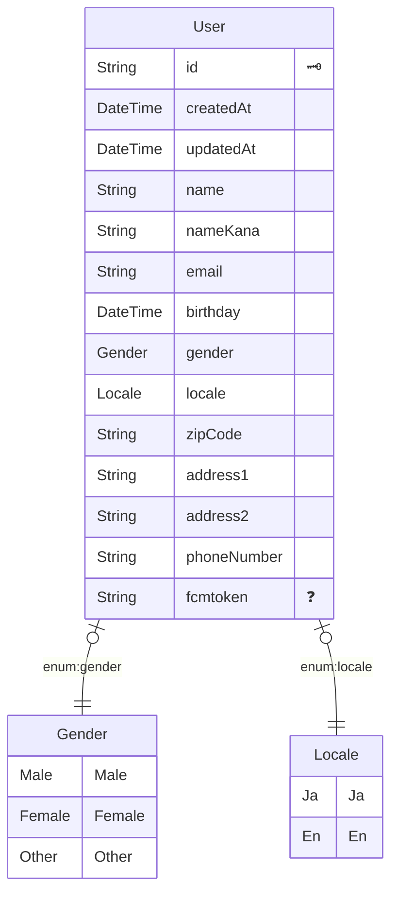

```mermaid
erDiagram

        Gender {
            Male Male
Female Female
Other Other
        }
    


        Locale {
            Ja Ja
En En
        }
    
  "User" {
    String id "🗝️"
    DateTime createdAt 
    DateTime updatedAt 
    String name 
    String nameKana 
    String email 
    DateTime birthday 
    Gender gender 
    Locale locale 
    String zipCode 
    String address1 
    String address2 
    String phoneNumber 
    String fcmtoken "❓"
    }
  
    "User" o|--|| "Gender" : "enum:gender"
    "User" o|--|| "Locale" : "enum:locale"
```
